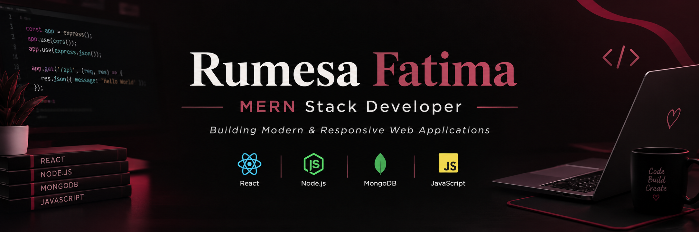
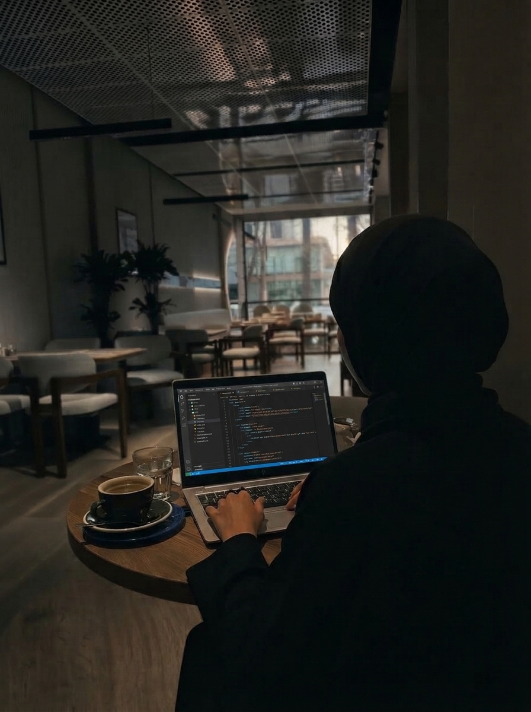

  

<h2> About Me</h2>

<table>
<tr>
<td width="55%" valign="top">

### Assalamualaikum! 👋

I'm **Rumesa Fatima**, a **MERN Stack Developer** passionate about building modern, responsive, and user-friendly web applications.

I thrive turning ideas into real projects and learning through practical work.
I like exploring different approaches before starting a project and choosing simple and effective solutions.

I work with **React, JavaScript, Node.js, Express.js, and MongoDB**, along with **HTML, CSS, Bootstrap, and Tailwind CSS**.

Currently, I am focused on improving my **MERN Stack skills** and building **real-world applications**.

</td>

<td width="45%" align="center">

</td>
</tr>
</table>
<h2>🔗 Connect With Me</h2>

  
  &nbsp;&nbsp;&nbsp;
  
  &nbsp;&nbsp;&nbsp;
  

<h2>🛠️ Tech Stack</h2>

  

<h2>📊 GitHub Analytics</h2>

  

  

  

